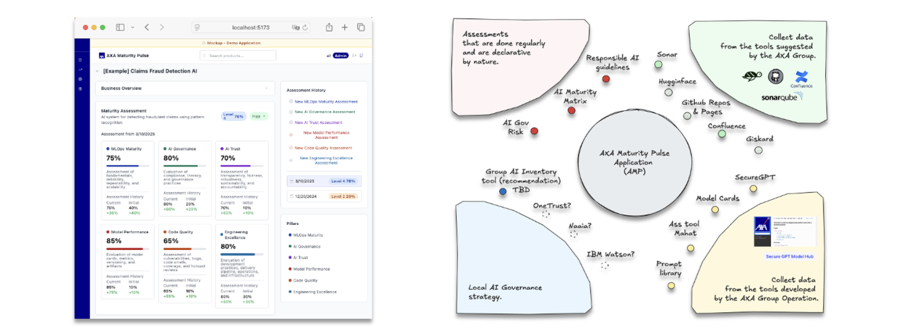
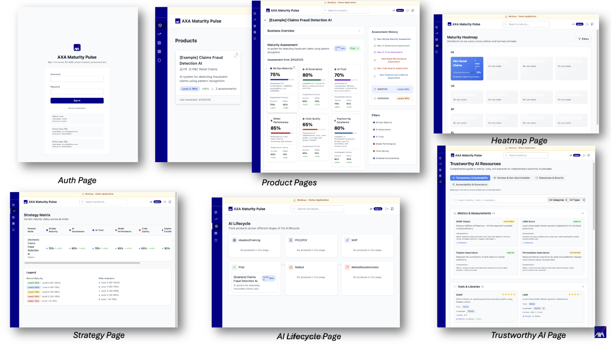

# Maturity Pulse (Mockup)

## Table of Contents (ToC)

- [Maturity Pulse (Mockup)](#maturity-pulse-mockup)
  - [Table of Contents (ToC)](#table-of-contents-toc)
  - [Why? What? Benefits?](#why-what-benefits)
    - [Why?](#why)
  - [What?](#what)
  - [Benefits](#benefits)
  - [Getting Started](#getting-started)
    - [Prerequisites](#prerequisites)
    - [Installation](#installation)
  - [Pages overview](#pages-overview)
  - [Project Structure](#project-structure)
  - [Next steps | Idea](#next-steps--idea)
  - [Assessment Pillars](#assessment-pillars)
  - [Useful links](#useful-links)

## Why? What? Benefits?

### Why?

- Provide a clear, scalable and objective view of AI product status* across the group.
- Accelerate operational trust and excellence and feed collaboration and innovation.
- Empower leaders to steer AI strategy using live-trusted indicators* on project.

## What?

Building verifiable & measurable trust and maturity - we cannot master what we can not measure



## Benefits

- **Fewer excel sheets and surveys:** reduce need for manual operating of maturity or documentation with automated maturity feedbacks. #SCALABILITY
- **Better alignment between tech and leadership:** strengthens communication between tech and decision-makers by speaking a shared maturity language. #MEASURABLE
- **Better visibility on the AI portfolio:** gives a centralized view of all AI initiatives across the group. #TRANPARENCY
- **Faster maturity checks:** reinforce quality practices without extra-burden (e.g.  sonar, model cards, etc.).#AUTOMATION

## Getting Started

### Prerequisites

- Node.js 20.x or later
- npm 10.x or later
- SonarQube server (for code quality metrics)

### Installation

1. Install dependencies:

   ```bash
   npm install
   ```

2. Configure Github and G:
   - Create a `.env` file in the project root

3. Start the development server:

   ```bash
   npm run dev
   ```

4. Open [http://localhost:5173](http://localhost:5173) in your browser.

## Pages overview



## Project Structure

```sh
src/
├── components/         # Reusable UI components
│   ├── assessment/    # Assessment-related components
│   ├── charts/        # Chart components
│   ├── layout/        # Layout components
│   └── product/       # Product-related components
├── data/              # Mock data and constants
├── pages/             # Page components
└── types/             # TypeScript type definitions
```

## Next steps | Idea

- Test entity model cards imports
- Py Scripts
  - Update questions from csv files (e.g. Maturity Matrix)
  - Create product from .md file (model cards)
  - Compute and Update score from assessments
- CICD with Github Actions
- Host webapp - deployment
- Create WebAPI
- Migration DB (e.g. duckdb)
- Datalake PoC
- Get Confluence, Github Pages documentations
  - Create VectorDB

## Assessment Pillars

Coming soon.

## Useful links

Coming soon.
