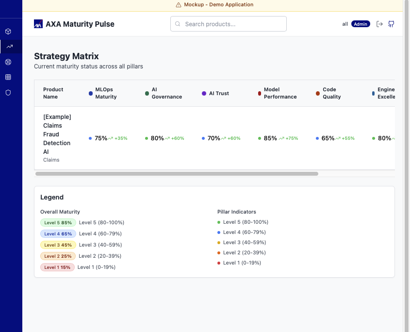

# Maturity Pulse (Mockup)

A comprehensive AI/ML project maturity assessment tool built with React and TypeScript.

## Overview

AXA Maturity Pulse is a tool designed to assess and track the maturity of AI/ML projects across different dimensions:

- MLOps Maturity
- AI Governance
- AI Trust
- Model Performance
- Code Quality

## Getting Started

### Prerequisites

- Node.js 20.x or later
- npm 10.x or later
- SonarQube server (for code quality metrics)

### Installation

1. Install dependencies:

   ```bash
   npm install
   ```

2. Configure Github and G:
   - Create a `.env` file in the project root

3. Start the development server:

   ```bash
   npm run dev
   ```

4. Open [http://localhost:5173](http://localhost:5173) in your browser.

## Features

### Auth page

A secure login page for user authentication.


### Products page

Displays a list of available AI/ML products.


### Product page of Maturity Result page

Shows detailed maturity assessment results for a selected product.


### Strategy page

Presents strategic recommendations based on assessment results.



### AI Lifecycle page

Visualizes the stages of the AI/ML project lifecycle.


### Heatmat page

Provides a heatmap view of maturity scores across different dimensions.


### Trustworthy AI page

Highlights trust and governance aspects of AI projects.


## Project Structure

```sh
src/
├── components/         # Reusable UI components
│   ├── assessment/    # Assessment-related components
│   ├── charts/        # Chart components
│   ├── layout/        # Layout components
│   └── product/       # Product-related components
├── data/              # Mock data and constants
├── pages/             # Page components
└── types/             # TypeScript type definitions
```

## Next steps | Idea

- Test entity model cards imports
- Py Scripts
  - Update questions from csv files (e.g. Maturity Matrix)
  - Create product from .md file (model cards)
  - Compute and Update score from assessments
- CICD with Github Actions
- Host webapp - deployment
- Create WebAPI
- Migration DB (e.g. duckdb)
- Datalake PoC
- Get Confluence, Github Pages documentations
  - Create VectorDB

## Assessment Pillars

Coming soon.

## Useful links

Coming soon.
